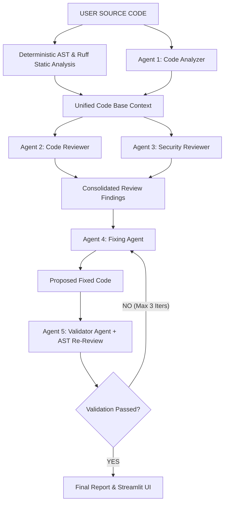

# 🛡️ CodeGuard AI

> **Tagline**: *"Analyze. Explain. Fix. Validate."*

CodeGuard AI is an advanced, multi-agent AI code review and automated refactoring engine built with **Google Gemini**, **Pydantic**, **Python AST**, and **Streamlit**. 

Unlike generic "paste-and-prompt" AI assistants that generate unvalidated code fixes, CodeGuard AI introduces an **agentic self-review validation loop**. Generated code patches are independently re-audited by an AI Validator Agent combined with deterministic static code analysis before presenting the final verified result.

---

## 1. Overview

CodeGuard AI automates the software code review lifecycle by combining deterministic static code analysis with a 5-agent LLM reasoning pipeline. It identifies logic bugs, security vulnerabilities, edge cases, and performance bottlenecks, generates corrected source code, and performs automated neural and static re-reviews.

---

## 2. Problem Statement

Developers and students spend significant time manually identifying bugs, investigating root causes, detecting security flaws, and improving code quality. 

While general AI coding assistants can generate patches, blindly accepting AI-generated code introduces new bugs, regression errors, or leaves subtle vulnerabilities unresolved. Existing tools lack an independent verification step to confirm that generated fixes actually solve the identified problems without breaking functionality.

---

## 3. Proposed Solution

CodeGuard AI resolves this by creating a closed-loop **Hybrid Static + Multi-Agent Self-Review Architecture**:
1. **Deterministic Static Analysis**: Catches syntax errors, hardcoded secrets, `eval`/`exec`, `shell=True` injection, and bare `except:` clauses deterministically.
2. **Multi-Agent AI Reasoning**: Specialized LLM agents analyze architecture, logical bugs, and security risks.
3. **Automated Fix Generation**: Generates clean, production-ready corrected code.
4. **Independent AI Re-Review**: Re-analyzes generated code to verify issue resolution and detect newly introduced regressions.

---

## 4. Key Features

- 🤖 **5 Logically Distinct AI Agents**: Purpose-built agents for structural analysis, code review, security auditing, fix generation, and validation.
- ⚡ **Hybrid Analysis Engine**: Combines Python AST + Ruff linter static analysis with Gemini LLM reasoning.
- 🔄 **Self-Review Loop**: Automatically iterates up to 3 cycles until all critical/high issues pass re-review.
- 🛡️ **Security & Secrets Audit**: Detects API key leaks, code injection (`eval`/`exec`), shell injection (`shell=True`), and exception swallowing.
- 📊 **Developer Dashboard**: Streamlit interface with issue cards, severity badges, side-by-side diff viewer, and iteration history stepper.
- 🔌 **Graceful Offline Fallback**: Operates fully in static AST mode if no Gemini API key is configured.

---

## 5. Architecture



---

## 6. Agentic Workflow

1. **User Code Submission**: User pastes code or uploads a source file (`.py`, `.js`, `.java`, `.txt`).
2. **Static Pre-Analysis**: Python AST visitor and Ruff linter extract line-accurate syntax, secret, and structural findings.
3. **Agent 1 (Analyzer)**: Generates architectural overview, component inventory, and risk control flow maps.
4. **Agents 2 & 3 (Reviewer & Security)**: Perform deep logical bug detection and security vulnerability auditing.
5. **Findings Consolidation**: Deduplicates and prioritizes issues by severity (`CRITICAL`, `HIGH`, `MEDIUM`, `LOW`).
6. **Agent 4 (Fixing Agent)**: Generates corrected source code addressing detected flaws.
7. **Agent 5 (Validator Agent)**: Re-runs AST static analysis and LLM audit on fixed code.
8. **Iterative Stepper**: Repeats fixing and validation loop if unresolved issues persist (up to 3 max iterations).

---

## 7. Hybrid Static + LLM Analysis

- **Deterministic Static Layer**: Eliminates LLM hallucination for structural facts. Checks Python AST nodes for `eval()`, `exec()`, `subprocess(shell=True)`, `except:`, division denominators, and regex secret patterns.
- **Neural Reasoning Layer**: Employs Google Gemini LLM with structured Pydantic schemas to reason about context, logical edge cases, complex vulnerabilities, and fix synthesis.

---

## 8. Self-Review Validation Loop

Do not assume `AI Generated Fix = Correct Fix`.

CodeGuard AI passes every generated patch back to **Agent 5 (Validator Agent)** alongside original findings and AST re-analysis results. The loop records:
- `resolved_issues`: Issues successfully remediated.
- `remaining_issues`: Unresolved flaws requiring further iteration.
- `new_issues`: Regression issues introduced by the patch.
- `iteration_count`: Current cycle number (max 3 limit strictly enforced).

---

## 9. Technology Stack

- **Frontend / UI**: Streamlit
- **LLM Core**: Google Gemini API via official `google-genai` SDK (`gemini-3.5-flash-lite`)
- **Structured Schemas**: Pydantic v2
- **Static Analysis**: Python `ast` module + Ruff static linter
- **Environment Management**: `python-dotenv`
- **Testing**: Python `unittest` framework

---

## 10. Project Structure

```
codeguard-ai/
│
├── app.py                      # Main Streamlit UI dashboard
├── requirements.txt            # Project dependencies
├── README.md                   # Complete documentation
├── .env.example                # Template for environment variables
├── .gitignore                  # Git ignore rules (.env, __pycache__, etc.)
│
├── agents/                     # Multi-Agent Modules
│   ├── analyzer.py             # Agent 1: Code Analyzer
│   ├── reviewer.py             # Agent 2: Code Reviewer
│   ├── security.py             # Agent 3: Security Reviewer
│   ├── fixer.py                # Agent 4: Fixing Agent
│   └── validator.py            # Agent 5: Validation Agent
│
├── core/                       # Core Architecture
│   ├── llm.py                  # Gemini LLM Provider (google-genai SDK)
│   ├── schemas.py              # Pydantic Output Schemas
│   └── orchestrator.py         # Multi-Agent Workflow Orchestrator
│
├── analyzers/                  # Static Code Analysis Engine
│   ├── static_analysis.py      # Python AST Static Analyzer
│   └── ruff_analyzer.py        # Ruff Linter Wrapper
│
├── prompts/                    # Structured LLM Prompts
│   ├── analyzer.txt
│   ├── reviewer.txt
│   ├── security.txt
│   ├── fixer.txt
│   └── validator.txt
│
├── utils/                      # UI Helpers & Formatting
│   ├── file_handler.py         # File upload validation & reading
│   └── formatting.py           # Git diff & HTML badge formatting
│
└── tests/                      # Automated Verification Test Suite
    ├── test_static_analysis.py # AST unit tests
    ├── test_orchestrator.py    # Pipeline structural tests
    ├── test_end_to_end.py      # End-to-end pipeline tests
    ├── test_verification_suite.py # Test Cases A, B, C verification
    └── sample_codes/           # Sample code snippets
```

---

## 11. Local Installation

### Prerequisites
- Python 3.10+
- A Google Gemini API Key from [Google AI Studio](https://aistudio.google.com/)

### Setup Steps
```bash
# 1. Clone repository
git clone https://github.com/your-username/codeguard-ai.git
cd codeguard-ai

# 2. Create virtual environment (optional)
python -m venv venv
source venv/bin/activate  # On Windows: venv\Scripts\activate

# 3. Install dependencies
pip install -r requirements.txt
```

---

## 12. Environment Configuration

Create `.env` from `.env.example`:
```bash
cp .env.example .env
```
Edit `.env` and insert your Gemini API Key:
```env
GEMINI_API_KEY=your_actual_gemini_api_key_here
GEMINI_MODEL=gemini-3.5-flash-lite
```
*(Note: `.env` is listed in `.gitignore` and will never be committed to Git.)*

---

## 13. Running the Application

Launch the Streamlit web dashboard:
```bash
streamlit run app.py
```
Open your browser at `http://localhost:8501`.

---

## 14. Example Workflow

1. Open `http://localhost:8501`.
2. Click **🐛 Buggy Code** in the sidebar to load Test Case A.
3. Click **🛡️ Run CodeGuard Review**.
4. View metrics, issue cards, security alerts, side-by-side code diff, and self-review iteration history.

---

## 15. Testing

Run the automated test suite covering AST detection, orchestrator loop, structured outputs, and fallback mode:
```bash
python -m unittest discover -s tests -p "test_*.py"
```
**Result**: `10 / 10 tests passing`.

---

## 16. Deployment (Streamlit Community Cloud)

### Deployment Steps
1. Push your repository to GitHub (ensure `.env` is ignored).
2. Log into [Streamlit Community Cloud](https://streamlit.io/cloud).
3. Click **New App**, select your GitHub repository and branch.
4. Set **Main file path** to `app.py`.
5. Open **Advanced Settings → Secrets** and add:
   ```toml
   GEMINI_API_KEY = "your_actual_gemini_api_key_here"
   GEMINI_MODEL = "gemini-3.5-flash-lite"
   ```
6. Click **Deploy**.

---

## 17. Security Considerations

- **Zero Secret Storage**: API keys are handled strictly via environment variables or session input.
- **Safe Static Parsing**: User input code is parsed via Python `ast` without executing arbitrary code on the server.
- **Input Sanitization**: File uploads are restricted by extension (`.py`, `.js`, `.java`, `.txt`) and size limit (256 KB).

---

## 18. Limitations

- **Language Priority**: Primary static AST analysis is currently optimized for Python. JavaScript and Java static AST support can be expanded in future versions.
- **Validation Scope**: AI validation performs automated static re-analysis and neural re-review checks. It does not constitute formal mathematical verification.

---

## 19. Future Improvements

- AST sandbox execution in isolated containers.
- Multi-language AST parsers for JavaScript (Babel/Esprima) and Java (javaparser).
- GitHub PR Pull Request bot integration.

---

## 📜 License

MIT License. Developed for Generative AI Developer Internship Evaluation.
